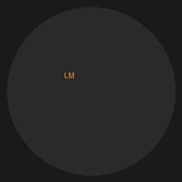

# LocalMind

A fully offline, privacy-first AI desktop application. Chat with local AI models — no internet required, no data leaves your machine.



## Features

- 💬 **Streaming chat** — responses appear token by token like ChatGPT
- 🧠 **Local AI models** — powered by Ollama, runs entirely on your machine
- 📁 **File upload** — chat with PDFs, Word docs, text files, and images
- 🗂️ **Conversation history** — all chats saved locally in SQLite
- 🎛️ **Model Manager** — download, switch, and delete models from inside the app
- 🔒 **100% private** — no API keys, no cloud, no data collection
- ⚡ **Auto-setup** — automatically installs and manages Ollama for you
- 📐 **Responsive** — works at any window size including split screen

## Tech Stack

- **Desktop**: Electron
- **Frontend**: React + TypeScript + Vite + Tailwind CSS + shadcn/ui
- **Backend**: FastAPI (Python) running as local subprocess
- **Database**: SQLite via aiosqlite
- **AI**: Ollama (local model runner)
- **Packaging**: electron-builder + PyInstaller

## System Requirements

- Windows 10/11 (64-bit)
- 8GB RAM minimum (16GB+ recommended)
- 10GB free disk space
- Internet connection only for initial model download

## Getting Started (Development)

### Prerequisites
- Node.js 18+
- Python 3.11+
- Ollama (https://ollama.com/download)

### Install dependencies
```bash
# Install frontend dependencies
cd frontend && npm install

# Install backend dependencies
cd backend && pip install -r requirements.txt

# Install Electron dependencies
cd .. && npm install
```

### Run in development mode
```bash
# Terminal 1 - Backend
cd backend && python -m uvicorn app.main:app --reload --port 8000

# Terminal 2 - Frontend
cd frontend && npm run dev

# Terminal 3 - Electron
npm start
```

## Building for Production

```bash
# Build backend exe
cd backend
python -m PyInstaller localmind-backend.spec --distpath dist --workpath build

# Build frontend + package
cd ..
npm run build:frontend
npm run build:electron
```

Installer will be at `dist/LocalMind Setup 1.0.0.exe`

## Recommended Models

| Model | Size | RAM | Best for |
|-------|------|-----|----------|
| llama3.1:8b | 4.9GB | 8GB | General chat |
| phi3:mini | 2.3GB | 4GB | Fast responses |
| mistral:7b | 4.1GB | 8GB | Code |
| llava:7b | 4.1GB | 8GB | Images + text |
| llama3.1:70b | 40GB | 32GB | Best quality |

## Privacy

All data stays on your machine:
- Conversations stored in SQLite at `%AppData%\LocalMind\localmind.db`
- Uploaded files processed locally, never transmitted
- Models stored at `~/.ollama/models`
- Zero telemetry, zero analytics

## License

MIT
